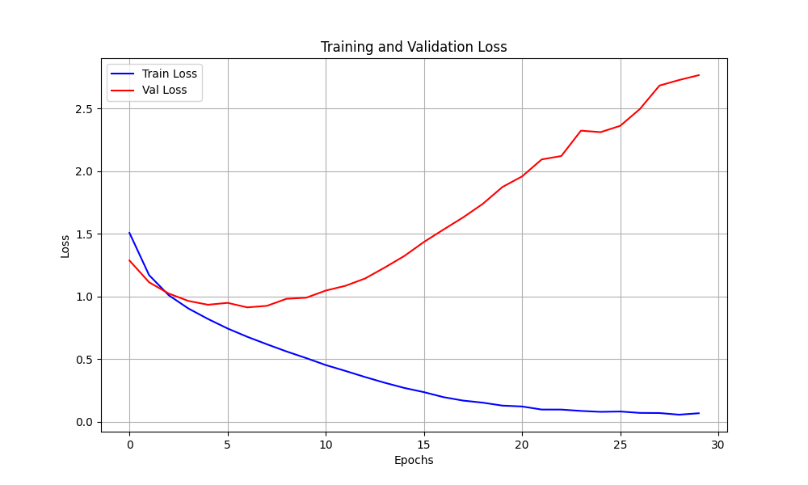

# Laboratory Report №1: Training Pipeline Implementation

**Topic:** Implementing a professional ML training pipeline for CIFAR-10 classification.

---

## 1. Introduction
This project aims to transition from basic machine learning scripts to a structured, modular MLOps-ready pipeline. The problem domain is image classification using the **CIFAR-10** dataset (60,000 images, 10 classes). The primary goal was to implement best practices such as configuration management, automated logging, and artifact versioning while training an "Improved CNN" model.

## 2. Pipeline Description
The project is organized into a modular structure to ensure maintainability and scalability:

* **Data Stage (`src/dataset.py`)**: Responsible for data ingestion, normalization, and splitting the training set into training (80%) and validation (20%) subsets.
* **Model Stage (`src/model.py`)**: Contains the `ImprovedCNN` architecture, optimized for 32x32 RGB images.
* **Training Stage (`src/pipeline.py`)**: 
    * Executes the training loop and monitors validation metrics.
    * Implements **Model Checkpointing**: automatically saves the model state only when the validation F1-score improves.
    * Generates visual learning curves (Loss Plot).
* **Execution Stage (`main.py`)**: The entry point that orchestrates the pipeline, handles device selection (GPU/CPU), and ensures all outputs are organized into a dedicated directory.

## 3. Model Evaluation & Overfitting Analysis
The model was trained for **30 epochs** on a Tesla T4 GPU (Google Colab).

### Performance Metrics:
- **Peak Validation F1-Score**: 0.6897 (at Epoch 8)
- **Final Test Accuracy**: ~69%
- **Final Test F1-Score**: ~0.69

### Deep Insight into Training:
The visual analysis of `loss_plot.png` and training logs reveals a classic **overfitting** scenario:
- **Optimal Point**: The model reached its best generalization capability at **Epoch 8**. At this stage, the Validation Loss was at its minimum (~0.92).
- **Divergence**: From Epoch 9 onwards, the Training Loss continued to decrease toward zero (0.05), while the Validation Loss began to climb sharply, reaching **2.76** by Epoch 30.
- **Result**: Thanks to the implemented checkpointing logic, the system successfully ignored the overfitted versions from later epochs and used the "Best Model" from Epoch 8 for final testing.

## 4. Best Practices
I have implemented the following industry-standard practices:
* **Configuration Management**: Used `configs/config.yaml` to decouple hyperparameters from the logic.
* **Automated Logging**: Used the `logging` module to record the training process in `outputs/training.log`.
* **Artifact Organization**: All results (logs, plots, `.pth` models) are automatically gathered in an `outputs/` folder using the `os` module.
* **Code Quality**: Applied Type Hinting and detailed comments for professional documentation.

## 5. Reflection
The experiment with 30 epochs was highly effective in identifying the model's capacity limits. While the model is functional and accurate (~69%), it is prone to overfitting quite early (after 8 epochs) due to the lack of regularization.

**Future Improvements:**
1.  **Data Augmentation**: Introducing random flips and rotations in `dataset.py` to improve generalization.
2.  **Regularization**: Adding Dropout layers in `model.py` and Weight Decay in the optimizer.
3.  **Early Stopping**: Implementing a mechanism to automatically halt training when the Validation Loss stops improving for 3-5 consecutive epochs.

---

## 6. Code Submission
**GitHub Repository:** [https://github.com/sophiakoroliova/mlops_lab1](https://github.com/sophiakoroliova/mlops_lab1)  
*The repository includes all source code, configuration files, and the `outputs/` directory with saved artifacts.*
